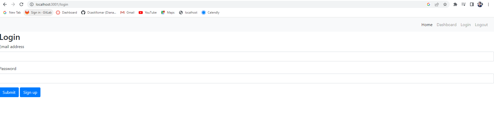
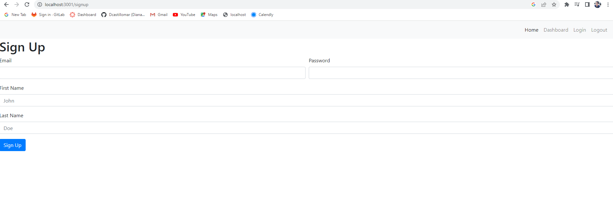

# Tech-Blog
  
   
  ## Table of Content
  - [Description](#Description)
  - [Installation](#Installation)
  - [Usage](#Usage)
  - [Contribution](#Contribution)
  - [Questions](#Questions)
  - [Test](#Test)
  - [License](#license)

  ## Description
  This website is a blog website where the user can see the sites blog posts. The user needs to signup and be logged in to comment, post a new blog, or logout.

  ## Installation
  Please install express, express-session, and express-handlebars.

  ## Usage
  When you open the site it will take you to the homepage where all the blogs are list. You can click on a blog to view the entire post and make a comment. Before making a comment, if not signed in clicking the submit button will take the user to the login page. When logged in, the user can make a comment or go to the dashboard where they can create their own blog post. When finished, the user can click the logout to log out or wait 15minutes to be logged out automatically.

  ## Contribution
  Please contact me with any questions.

  ## Questions
  email- dcastillomar89@yahoo.com
  
  github- dcastillomar

  ## Test 
  N/A

  ## License
    
This project is licensed under the MIT license.

Deployed Heroku website: https://project14blog-82f331f77726.herokuapp.com/

